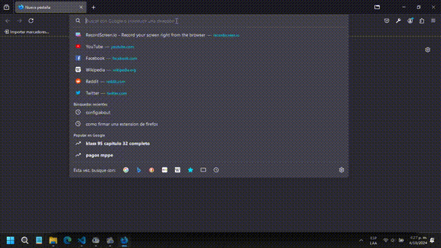
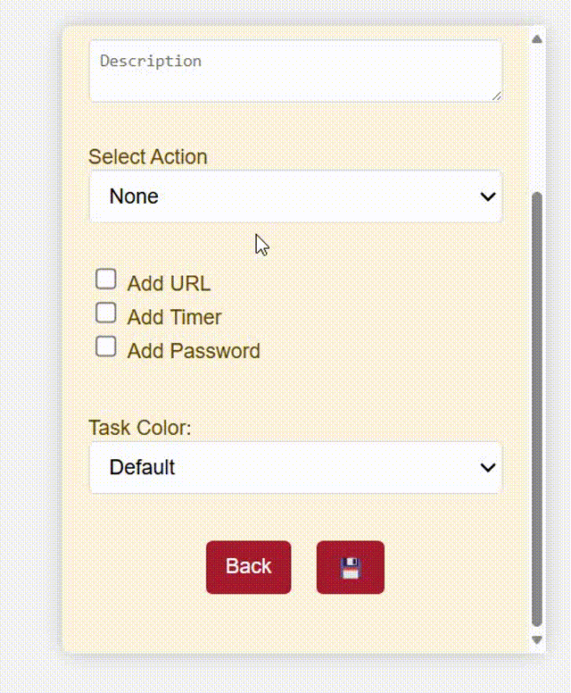
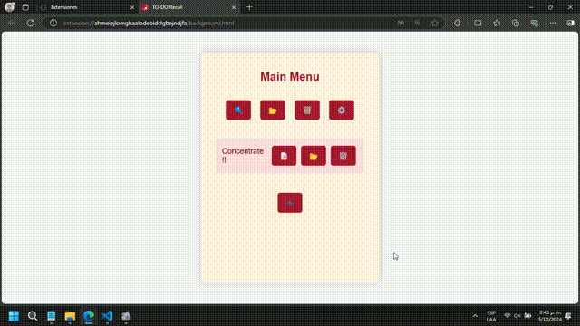
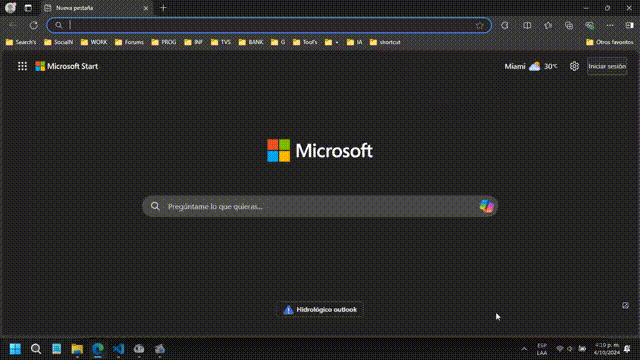
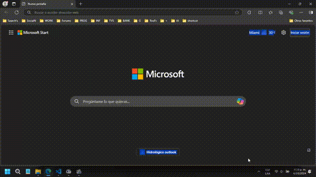
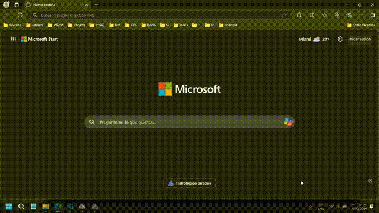

# ToDo Recall


#### Video Demo:  [Click here](https://youtu.be/qT37dxixkns)

## Brief Description
<details open> <summary></summary>

**ToDo Recall** is an extension for managing tasks and reminders directly in the browser. It allows you to organize notes, set alarms, and perform automated actions on browser tabs.
</details>

## Menu
- [Brief Description](#brief-description)
- [Installation](#installation)
  - [Google Chrome](#google-chrome)
  - [Microsoft Edge](#microsoft-edge)
  - [Mozilla Firefox](#mozilla-firefox)
- [Usage](#usage)
- [Features](#features)
- [Uninstallation](#uninstallation)
  - [Google Chrome](#google-chrome-1)
  - [Microsoft Edge](#microsoft-edge-1)
  - [Mozilla Firefox](#mozilla-firefox-1)
- [Folder Structure](#folder-structure)
- [Tested Versions](#tested-versions)
- [Resources Used](#resources-used)
- [Authors or Credits](#authors-or-credits)

## Installation
<details open> <summary></summary>

### Google Chrome

1. Open Chrome.
2. In the address bar, type `chrome://extensions/` and press **Enter**.
3. Enable **Developer mode** in the top right corner.
4. Click on **Load unpacked**.
5. Select the extension folder and click **OK**.
6. The extension will load and appear in the list of extensions.

### Microsoft Edge

1. Open Edge.
2. In the address bar, type `edge://extensions/` and press **Enter**.
3. Enable **Developer mode** in the bottom left corner.
4. Click on **Load unpacked**.
5. Select the extension folder and click **OK**.
6. The extension will load and appear in the list of extensions.

### Mozilla Firefox


0. Inside the extension folder, open the **manifest** folder, then the **firefox** folder, and replace the `manifest.json` file in the main folder with the one from the **firefox** folder.
1. Open Firefox.
2. In the address bar, type `about:debugging` and press **Enter**.
3. Select **This Firefox** in the left sidebar menu.
4. Click on **Load Temporary Add-on**.
5. Select the `manifest.json` file inside the extension folder and click **Open**.
6. The extension will load temporarily. It will be uninstalled when you close Firefox.



Also, with the **Developer Edition** and **Nightly** versions of Firefox, you can use unsigned add-ons if you change the `xpinstall.signatures.required` preference to `false` in Firefox's configuration editor `about:config`.

</details>

## Usage
<details open> <summary></summary>

Once the extension is installed, you can access task management and reminder functionalities from the extension icon in your browser.
</details>

## Features
<details open> <summary></summary>

1. **Task-note creation**: Add tasks by pressing the "+" button. You can create a new note by assigning a title and a description to save your note in the application.

<details close> <summary></summary>




</details>

2. **Alarm assignment**: You can assign alarms to your saved notes by adding a timer and setting a date. If you want to set an alarm, you can select "Single Timer" for a specific date, while to set an alarm that will sound all day, you have to select "Daily Timer" and set the time at which this alarm will sound each day.

Active alarms will be those in the main menu; any task with an alarm that is archived or in the trash will not activate its alarm.

<details close> <summary></summary>


</details>

3. **Tab actions**: Automate opening and closing specific tabs based on your reminders. You can add actions to your alarms, which can be opening or closing a tab containing a specific link. You can also close all tabs with a specific link by adding a "*" at the end of the link, or simply close all tabs by not assigning a URL to the task but activating the close tab option in the task.

<details close> <summary></summary>


</details>

4. **Automatic task deletion**: Tasks can be automatically deleted after their alarm is activated. You can assign your task the ability to delete itself once its assigned alarm is activated by selecting the "Self-destruct" option.

<details close> <summary></summary>



</details>

5. **Pomodoro**: Use the Pomodoro timer for effective work cycles. You can program your task as a pomodoro by selecting the "pomodoro" option in your task once you have already selected the "Daily Timer" alarm type. By doing this, instead of assigning a date, you will assign a number that will be the number of minutes in which the alarm will continuously activate.

<details close> <summary></summary>


</details>

6. **User management**: Multiple users can save their own notes and alarms.

<details close> <summary></summary>


</details>

7. **Import and export**: Manage your tasks using CSV files.

<details close> <summary></summary>

**Import**



**Export**



</details>

8. **Full-size view**: Expand the extension view to full screen for better visualization by pressing the title of the main menu, which will open the To-Do in a larger tab for easier data viewing.

<details close> <summary></summary>



</details>

9. **Multilingual**: Available in 7 languages ([English](./readme.md "English"), , [Spanish](./readme_es.md "Español"), German, Portuguese, Chinese, Hindi, and Russian).

<details close> <summary></summary>


</details>

10. **Security**: In addition to the appropriate validations to correctly save data, it has passwords for users and tasks to maintain privacy in the tasks you have or to save different workspaces to organize specific tasks for each moment. All information is saved on the computer offline, but the data is protected by encrypting it so that only encrypted data is saved, which can only be read by the extension itself.
</details>

## Uninstallation
<details open> <summary></summary>

### Google Chrome


1. Open Chrome and go to `chrome://extensions/`.
2. Locate the extension and click **Remove**.
3. Confirm the action in the popup window.

### Microsoft Edge


1. Open Edge and go to `edge://extensions/`.
2. Locate the extension and click **Remove**.
3. Confirm the action in the popup window.

### Mozilla Firefox


1. Open Firefox and go to `about:addons`.
2. In the list of extensions, find the one you want to uninstall and click **Remove**.
</details>

## Extension folder structure
<details close> <summary></summary>

```bash
/TO-DO-RECALL
├── /css
│   ├── /styles
│   │   └── buttons.css
│   │   └── color.css
│   │   └── dropdown.css
│   │   └── forms.css
│   │   └── global.css
│   │   └── lists.css
│   │   └── media-queries.css
│   │   └── utilies.css
│   │   └── view.css
│   └── styles.css
├── /js
│   ├── /controller
│   │   ├── /crud
│   │   │   └── crudtask.js
│   │   │   └── cruduser.js
│   │   ├── /validate
│   │   │   └── validatetask.js
│   │   │   └── validateuser.js
│   │   └── autobookmark.js
│   │   └── color.js
│   │   └── csv.js
│   │   └── display.js
│   │   └── init.js
│   │   └── keyboard.js
│   │   └── lang.js
│   │   └── listener.js
│   │   └── password.js
│   │   └── userprofile.js
│   ├── /model
│   │   ├── /background
│   │   │   └── alarm.js
│   │   │   └── background.js
│   │   │   └── destroytask.js
│   │   │   └── managertask.js
│   │   │   └── notification.js
│   │   ├── /data
│   │   │   └── datasync.js
│   │   │   └── taskdata.js
│   │   │   └── userdata.js
│   │   ├── /extension
│   │   │   └── extOrWeb.js
│   │   │   └── idegen.js
│   │   │   └── reload.js
│   │   ├── /storage
│   │   │   ├── /encrypt
│   │   │   │   └── encrypt.js
│   │   │   └── storagetask.js
│   │   │   └── storageuser.js
│   │   │   └── storagewrapper.js
│   │   └── init.js
│   ├── /view
│   │   └── init.js
│   │   └── showmenu.js
│   │   └── taskmenu.js
│   │   └── usermenu.js
│   └── script.js
├── /locales
│   ├── de.json
│   ├── en.json 
│   ├── es.json 
│   ├── hi.json
│   ├── pt.json
│   ├── ru.json
│   └── zh.json    
├── /manifest
│   └── /chrome
│   │   └── manifest.json
│   ├── /firefox
│   │   └── manifest.json
├── /src
│   ├── icon.py
│   ├── icon16.png
│   ├── icon48.png
│   ├── icon128.png
│   └── settings.png
└── background.html
└── manifest.json
```

</details>

## Tested Versions
<details open> <summary></summary>

* **Google Chrome** [Version 129.0.6668.90](https://chromereleases.googleblog.com/2024/10/stable-channel-update-for-desktop.html) (Official Build) (64-bit) October 1, 2024
* **Microsoft Edge** [Version 129.0.2792.79](https://learn.microsoft.com/en-us/deployedge/microsoft-edge-relnote-stable-channel#version-1290279279-october-3-2024) (Official Build) (64-bit) October 3, 2024
* **Firefox Desktop** [Version 131.0](https://www.mozilla.org/en-US/firefox/131.0/releasenotes/) (64-bit) October 1, 2024
* **Firefox Developer Edition** [Version 132.0b3](https://www.mozilla.org/en-US/firefox/132.0beta/releasenotes/?utm_source=firefox-browser&utm_medium=firefox-desktop&utm_campaign=about-dialog) (64-bit) October 4, 2024

</details>

## Resources Used
<details open> <summary></summary>

* [Your first extension](https://developer.mozilla.org/en-US/docs/Mozilla/Add-ons/WebExtensions/Your_first_WebExtension)
* [Google Chrome Official Tutorial](https://developer.chrome.com/docs/extensions/get-started/tutorial/hello-world)
* [Create and publish custom Chrome extensions and apps](https://support.google.com/chrome/a/answer/2714278?hl)

</details> 

## Authors or Credits
<details open> <summary></summary>

* Created by [Yordis Cujar](https://www.linkedin.com/in/yordiscujar/).
* Credits to David J. Malan and the CS50 course at Harvard University for their guidance.


</details>