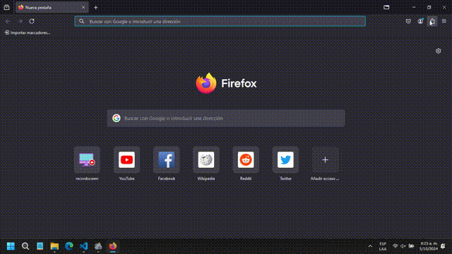

# ToDo Recall


#### Video Demo:  [Has click aqui](https://youtu.be/qT37dxixkns)

## Descripción Breve
<details open> <summary></summary>

**ToDo Recall** es una extensión para gestionar tareas y recordatorios directamente en el navegador. Permite organizar notas, asignar alarmas, y realizar acciones automatizadas en las pestañas del navegador.
</details>

## Menú
- [Descripción Breve](#descripción-breve)
- [Instalación](#instalación)
  - [Google Chrome](#google-chrome)
  - [Microsoft Edge](#microsoft-edge)
  - [Mozilla Firefox](#mozilla-firefox)
- [Uso](#uso)
- [Características](#características)
- [Desinstalación](#desinstalación)
  - [Google Chrome](#google-chrome-1)
  - [Microsoft Edge](#microsoft-edge-1)
  - [Mozilla Firefox](#mozilla-firefox-1)
- [Estructura de Carpetas](#estructura-de-carpetas)
- [Versiones Testeadas](#versiones-testeadas)
- [Recursos Usados](#recursos-usados)
- [Autores o Créditos](#autores-o-créditos)

## Instalación
<details open> <summary></summary>

### Google Chrome

1. Abre Chrome.
2. En la barra de direcciones, escribe `chrome://extensions/` y presiona **Enter**.
3. Activa el **Modo desarrollador** en la esquina superior derecha.
4. Haz clic en **Cargar descomprimida**.
5. Selecciona la carpeta de la extensión y haz clic en **Aceptar**.
6. La extensión se cargará y aparecerá en la lista de extensiones.

### Microsoft Edge

1. Abre Edge.
2. En la barra de direcciones, escribe `edge://extensions/` y presiona **Enter**.
3. Activa el **Modo desarrollador** en la esquina inferior izquierda.
4. Haz clic en **Cargar extensión descomprimida**.
5. Selecciona la carpeta de la extensión y haz clic en **Aceptar**.
6. La extensión se cargará y aparecerá en la lista de extensiones.

### Mozilla Firefox


0. Dentro de la carpeta de la carpeta de la extensión abe la carpeta **manifest**, luego la carpeta **firefox** y cambia el archivo `manifest.json` de la carpeta principal por el de la carpeta **firefox**.
1. Abre Firefox.
2. En la barra de direcciones, escribe `about:debugging` y presiona **Enter**.
3. Selecciona **Esta sesión de Firefox** en el menú lateral izquierdo.
4. Haz clic en **Cargar complemento temporal**.
5. Selecciona el archivo `manifest.json` dentro de la carpeta de la extensión y haz clic en **Abrir**.
6. La extensión se cargará temporalmente. Se desinstalará cuando cierres Firefox.


Tambien con la versión **Developer Edition** y la versión **Nightly** de Firefox te permitiran usar complementos sin firmar si cambias la preferencia `xpinstall.signatures.required` a `false` en el editor de configuración de Firefox `about:config`.

</details>

## Uso
<details open> <summary></summary>

Una vez instalada la extensión, podrás acceder a las funcionalidades de gestión de tareas y recordatorios desde el icono de la extensión en tu navegador.
</details>

## Características
<details open> <summary></summary>

1. **Creación de tareas-notas**: Añade tareas presionando el botón de "+" puedes crear una nueva nota, para esto solo necesitas asignar un título y una descripción para poder guardar tu nota en la aplicación.

<details close> <summary></summary>


</details>

2. **Asignación de alarmas**: Puedes asignarles alarmas a tus notas guardadas agregándole un temporizador y asignando una fecha. Si quieres asignar una alarma, puedes seleccionar "Temporizador Único" para una fecha específica mientras que para asignar una alarma que sonara todo el día tienes que seleccionar "Temporizador Diario" y asignar la hora en la que sonara esta alarma cada día.

Las alarmas activadas serán las que se encuentren en el menú principal, toda tarea con alarma que se encuentre dentro de los archivados o en la papelera no activara su alarma.

<details close> <summary></summary>


</details>

3. **Acciones sobre pestañas**: Automatiza la apertura y cierre de pestañas específicas basadas en tus recordatorios. Puedes agregarles acciones a tus alarmas, están pueden ser abrir o cerrar una pestaña que contenga un link especifico, también puedes cerrar todas las pestañas con un link especifico agregando un "*" al final del link o simplemente cerrar todas las pestañas solo no asignando un URL a la tarea, pero activando el cerrar pestaña en la tarea.

<details close> <summary></summary>


</details>

4. **Eliminación automática de tareas**: Las tareas pueden eliminarse automáticamente tras activar su alarma. Puedes asignarle a tu tarea la capacidad de eliminarse una vez activada su alarma asignada, esto lo puedes lograr seleccionando la opción "Auto-destrucción".

<details close> <summary></summary>


</details>

5. **Pomodoro**: Usa el temporizador Pomodoro para ciclos de trabajo efectivos. Puedes programar tu tarea como un pomodoro seleccionando en tu tarea la opción "pomodoro" una vez que ya tengas seleccionado el tipo de alarma "Temporizador diario", haciendo esto en vez de asignar una fecha asignaras un número que será la cantidad de minutos en la cual se activará la alarma continuamente.

<details close> <summary></summary>


</details>

6. **Manejo de usuarios**: Varios usuarios pueden guardar sus propias notas y alarmas.

<details close> <summary></summary>


</details>

7. **Importación y exportación**: Maneja tus tareas mediante archivos CSV.

<details close> <summary></summary>

**Importacion**


**Exportacion**


</details>

8. **Vista a tamaño completo**: Amplía la vista de la extensión a pantalla completa para una mejor visualización presionando el título del menú principal abrirá el To-Do en una pestaña en mayor tamaño, para poder ver los datos con mayor facilidad.

<details close> <summary></summary>


</details>

9. **Multilenguaje**: Disponible en 7 idiomas ([Ingles](./readme.md "English"), [Español](./readme_es.md "Español"), Alemán, Portugués, Chino, Hindi y Ruso).

<details close> <summary></summary>


</details>

10. **Seguridad**: Además de las validaciones adecuadas para guardar correctamente los datos, cuenta con contraseñas para usuarios y tareas para mantener privacidad en las tareas que tienes o para guardar diferentes espacios de trabajos para tener organizados tareas específicas para cada momento. Toda la información se guarda en el computador sin conexión pero se protegen los datos cifrándolos para que solo se guarden datos cifrados que solo pueden ser leídos por la misma extensión.
</details>

## Desinstalación
<details open> <summary></summary>

### Google Chrome


1. Abre Chrome y ve a `chrome://extensions/`.
2. Localiza la extensión y haz clic en **Eliminar**.
3. Confirma la acción en la ventana emergente.

### Microsoft Edge


1. Abre Edge y ve a `edge://extensions/`.
2. Localiza la extensión y haz clic en **Eliminar**.
3. Confirma la acción en la ventana emergente.

### Mozilla Firefox



1. Abre Firefox y ve a `about:addons`.
2. En la lista de extensiones, busca la que deseas desinstalar y haz clic en **Eliminar**.
</details>

## Estructura de carpetas de la extensión
<details close> <summary></summary>

```bash
/TO-DO-RECALL
├── /css
│   ├── /styles
│   │   └── buttons.css
│   │   └── color.css
│   │   └── dropdown.css
│   │   └── forms.css
│   │   └── global.css
│   │   └── lists.css
│   │   └── media-queries.css
│   │   └── utilies.css
│   │   └── view.css
│   └── styles.css
├── /js
│   ├── /controller
│   │   ├── /crud
│   │   │   └── crudtask.js
│   │   │   └── cruduser.js
│   │   ├── /validate
│   │   │   └── validatetask.js
│   │   │   └── validateuser.js
│   │   └── autobookmark.js
│   │   └── color.js
│   │   └── csv.js
│   │   └── display.js
│   │   └── init.js
│   │   └── keyboard.js
│   │   └── lang.js
│   │   └── listener.js
│   │   └── password.js
│   │   └── userprofile.js
│   ├── /model
│   │   ├── /background
│   │   │   └── alarm.js
│   │   │   └── background.js
│   │   │   └── destroytask.js
│   │   │   └── managertask.js
│   │   │   └── notification.js
│   │   ├── /data
│   │   │   └── datasync.js
│   │   │   └── taskdata.js
│   │   │   └── userdata.js
│   │   ├── /extension
│   │   │   └── extOrWeb.js
│   │   │   └── idegen.js
│   │   │   └── reload.js
│   │   ├── /storage
│   │   │   ├── /encrypt
│   │   │   │   └── encrypt.js
│   │   │   └── storagetask.js
│   │   │   └── storageuser.js
│   │   │   └── storagewrapper.js
│   │   └── init.js
│   ├── /view
│   │   └── init.js
│   │   └── showmenu.js
│   │   └── taskmenu.js
│   │   └── usermenu.js
│   └── script.js
├── /locales
│   ├── de.json
│   ├── en.json 
│   ├── es.json 
│   ├── hi.json
│   ├── pt.json
│   ├── ru.json
│   └── zh.json    
├── /manifest
│   └── /chrome
│   │   └── manifest.json
│   ├── /firefox
│   │   └── manifest.json
├── /src
│   ├── icon.py
│   ├── icon16.png
│   ├── icon48.png
│   ├── icon128.png
│   └── settings.png
└── background.html
└── manifest.json
```

</details>

## Versiones Testeadas
<details open> <summary></summary>

* **Google Chrome** [Versión 129.0.6668.90](https://chromereleases.googleblog.com/2024/10/stable-channel-update-for-desktop.html) (Build oficial) (64 bits) 1 de octubre de 2024
* **Microsoft Edge** [Versión 129.0.2792.79](https://learn.microsoft.com/es-es/deployedge/microsoft-edge-relnote-stable-channel#version-1290279279-october-3-2024) (Compilación oficial) (64 bits) 3 de octubre de 2024
* **Firefox Desktop** [Versión 131.0](https://www.mozilla.org/en-US/firefox/131.0/releasenotes/) (64-bit) 1 de octubre de 2024
* **Firefox Developer Edition** [Versión 132.0b3](https://www.mozilla.org/en-US/firefox/132.0beta/releasenotes/?utm_source=firefox-browser&utm_medium=firefox-desktop&utm_campaign=about-dialog) (64-bit) 4 de octubre de 2024

</details>

## Recursos usados
<details open> <summary></summary>

* [Tu primera extensión](https://developer.mozilla.org/es/docs/Mozilla/Add-ons/WebExtensions/Your_first_WebExtension)
* [Tutorial Oficial de Google Chrome](https://developer.chrome.com/docs/extensions/get-started/tutorial/hello-world?hl=es-419)
* [Crear y publicar extensiones y aplicaciones de Chrome personalizadas](https://support.google.com/chrome/a/answer/2714278?hl)

</details> 

## Autores o Créditos
<details open> <summary></summary>

* Creado por [Yordis Cujar](https://www.linkedin.com/in/yordiscujar/).
* Créditos a David Ma J. Malan y al curso CS50 de la Universidad de Harvard por su guía.


</details> 
```